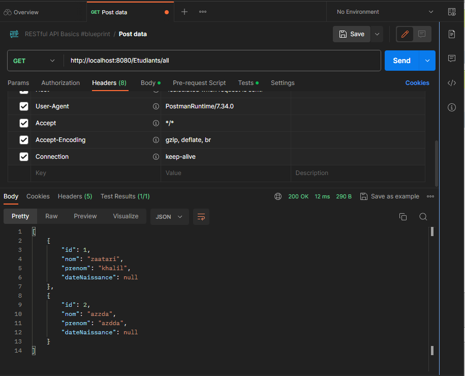
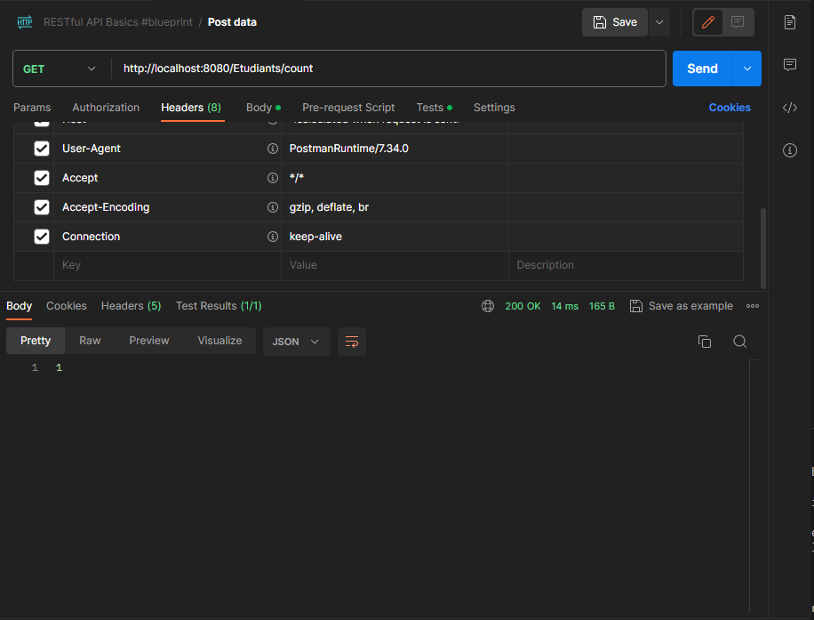
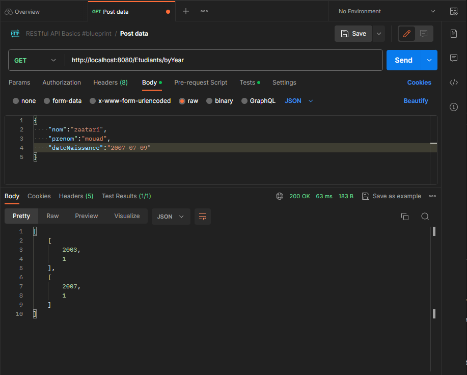
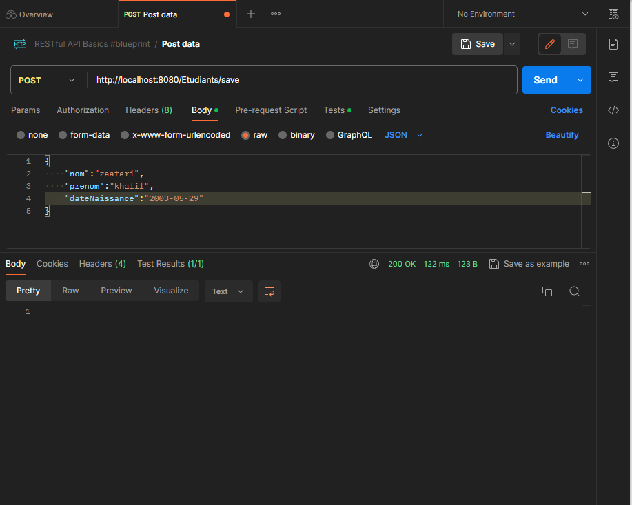
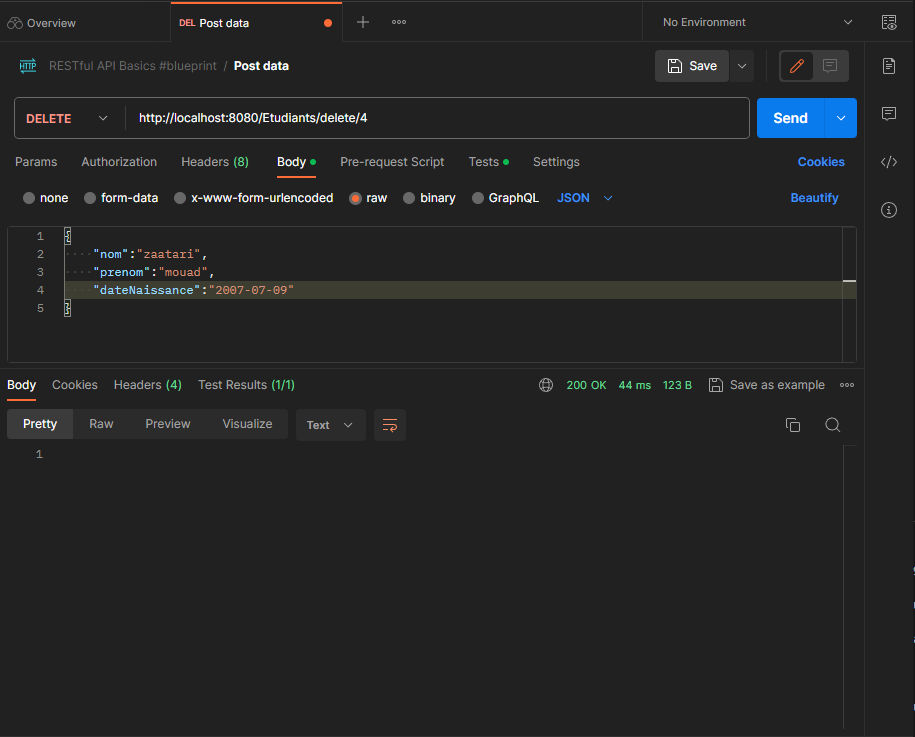

# Application Spring pour la Gestion des Étudiants

Ce référentiel contient une application Spring qui permet de gérer les informations des étudiants. L'application propose diverses fonctionnalités, notamment la visualisation des étudiants, la comptabilisation par année, et la création ou suppression d'étudiants.

## Comment Utiliser l'Application

Pour utiliser cette application Spring, suivez ces étapes :

1. Clonez ce référentiel sur votre machine locale.
2. Assurez-vous d'avoir les dépendances requises installées (Spring Boot, Java, etc.).
3. Configurez les informations de la base de données en modifiant le fichier `application.properties` pour spécifier le nom de la base de données, le nom d'utilisateur et le mot de passe associés.
4. Exécutez l'application en utilisant `./mvnw spring-boot:run` (ou `mvnw.cmd` sous Windows).
5. Accédez à l'application via l'adresse [http://localhost:8080](http://localhost:8080).

## Visualisation de Tous les Étudiants

Cette section vous permet de visualiser la liste complète des étudiants enregistrés dans la base de données.

## Obtenir le Nombre d'Étudiants

Cette fonction vous permet d'obtenir le nombre total d'étudiants enregistrés dans l'application. Elle fournit des informations essentielles sur l'effectif étudiant.

## Obtenir le Nombre d'Étudiants par Année

Cette fonction vous permet d'obtenir le nombre d'étudiants inscrits par année de naissance. Cela vous offre un aperçu de la répartition des étudiants en fonction de leur année de naissance.

## Créer un Nouvel Étudiant

La fonction "Créer un Nouvel Étudiant" vous permet d'ajouter un nouvel étudiant à la base de données de l'application. Vous pouvez saisir les détails de l'étudiant, tels que le nom, le prénom et la date de naissance, pour les enregistrer dans le système.

## Supprimer un Étudiant par ID

La fonction "Supprimer un Étudiant par ID" vous permet de supprimer un étudiant spécifique de la base de données en utilisant son identifiant (ID). Cela vous offre la possibilité de gérer la liste des étudiants enregistrés.

